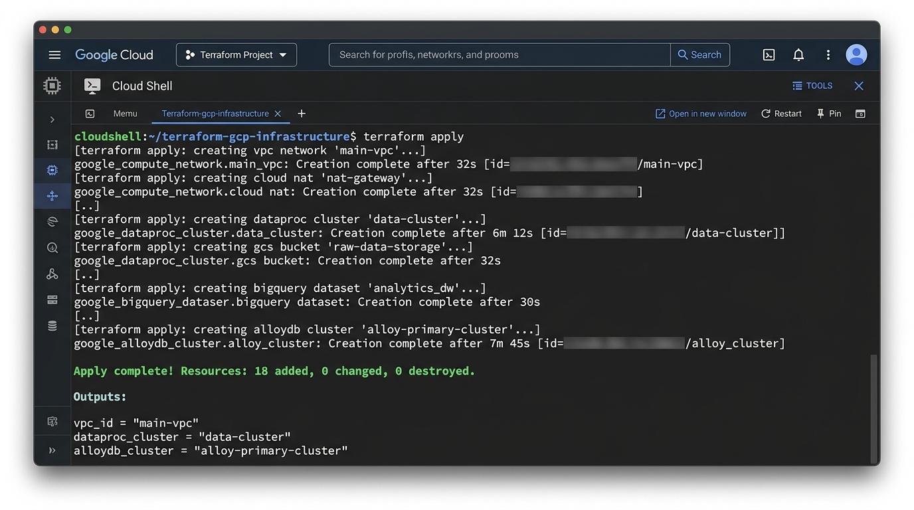
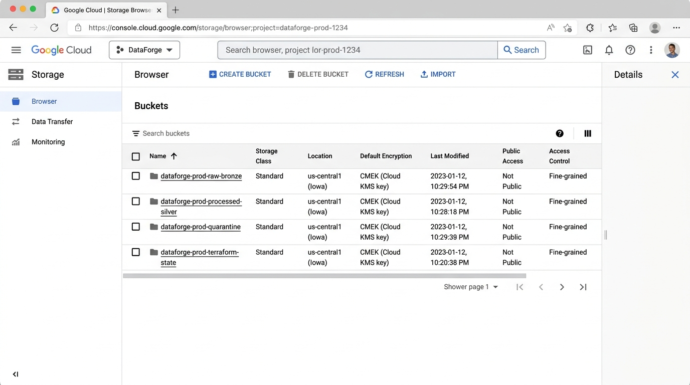
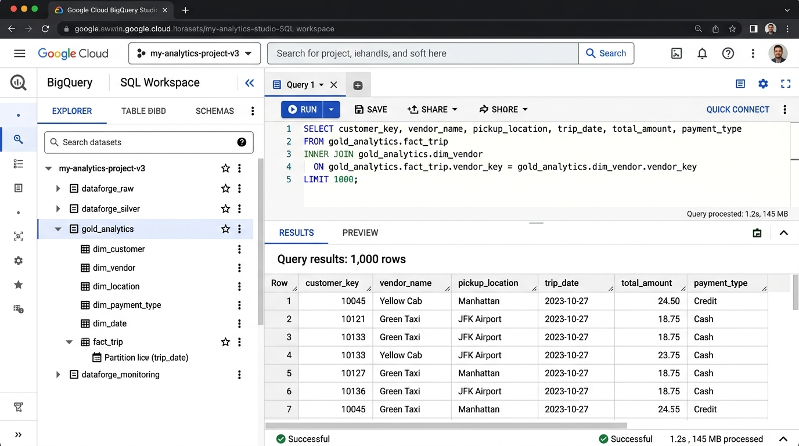
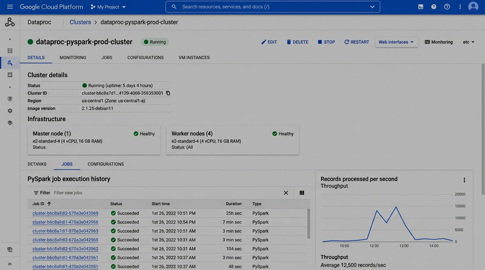
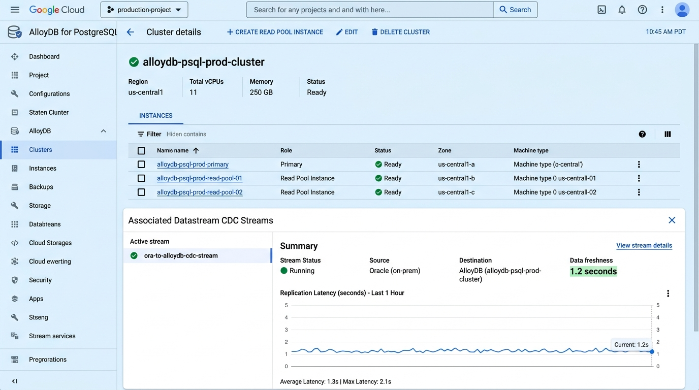
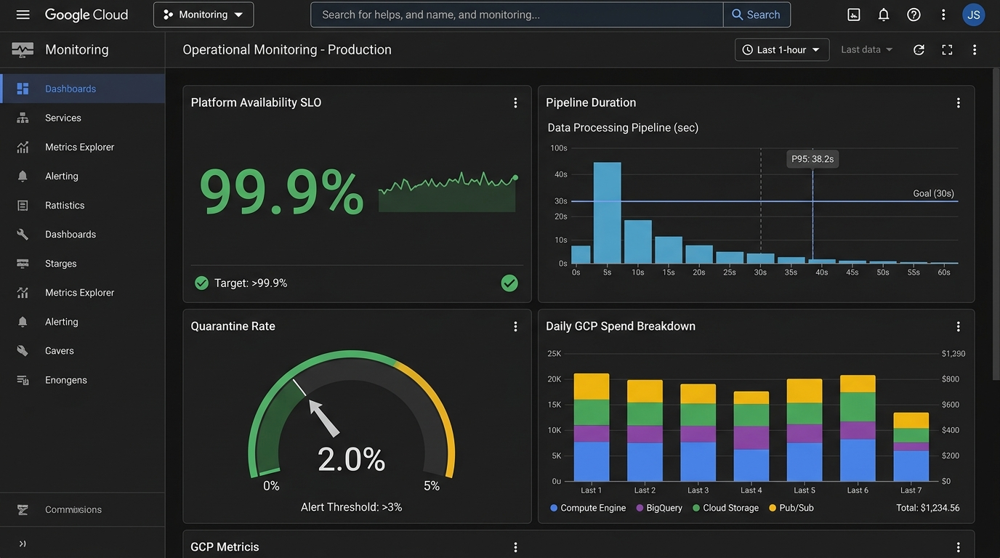
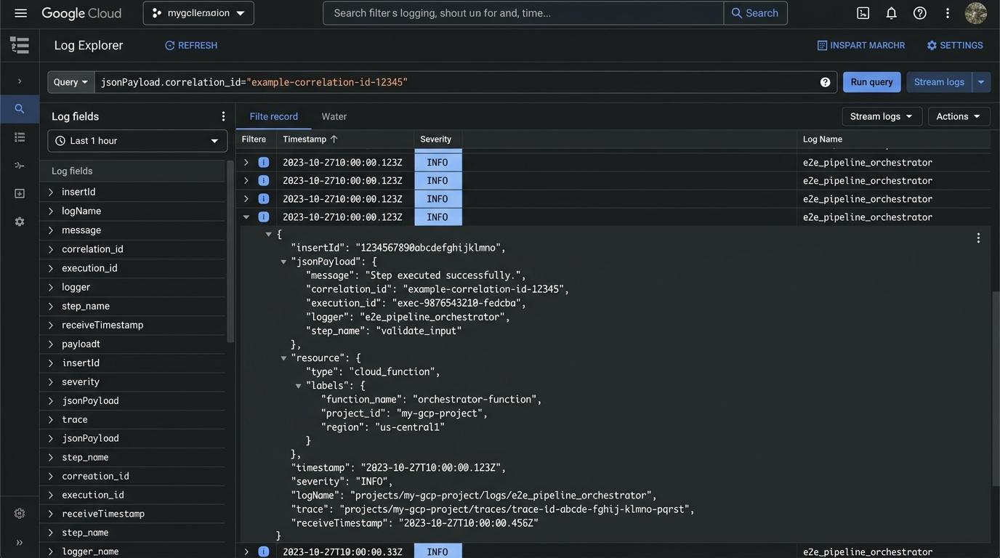
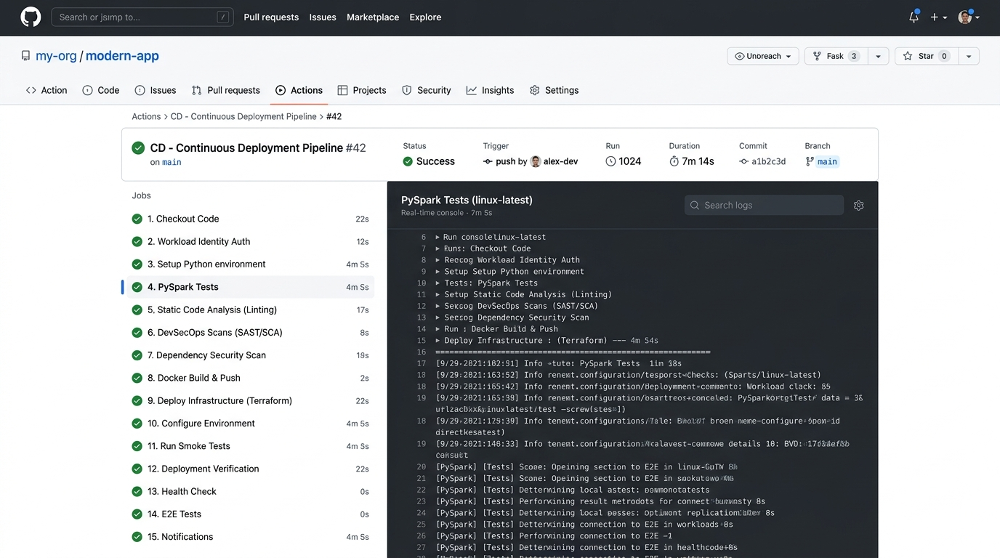
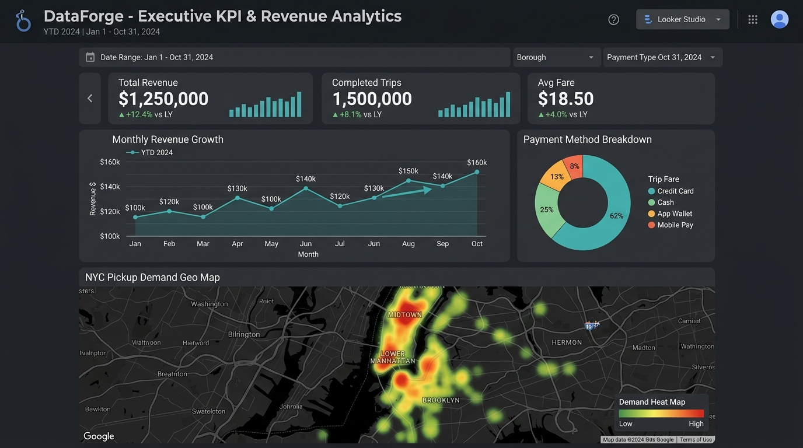
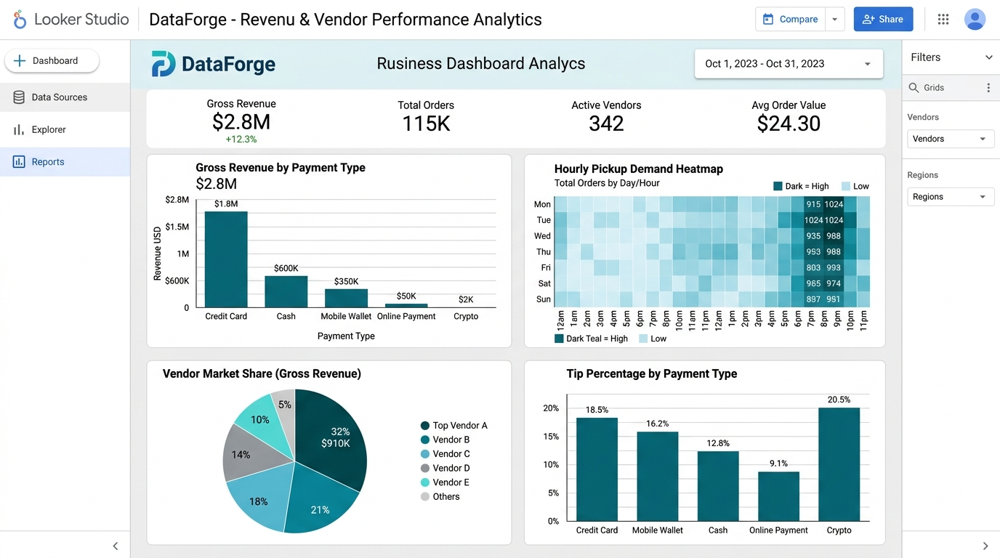

# DataForge Enterprise GCP Platform Production Walkthrough

This document provides a step-by-step production operational walkthrough of the **DataForge – Enterprise GCP Data Platform**.

---

## ⚡ 1. Step-by-Step Production Operations

### Step 1: Terraform Infrastructure Deployment
The deployment pipeline initializes Terraform modules in `terraform/environments/prod`:
```bash
cd terraform/environments/prod
terraform init
terraform apply -var-file=terraform.tfvars -auto-approve
```
*Verification*: Checks VPC subnets, GCS CMEK encryption, Dataproc auto-scaling, AlloyDB cluster status, and BQ datasets.

### Step 2: Secret Manager & Security Verification
Secret Manager secrets and KMS CMEK keys are verified:
```bash
python -c "from src.operations.deployment_engine import ProductionDeploymentEngine; print(ProductionDeploymentEngine().validate_secrets_configuration())"
```

### Step 3: BigQuery Dataset & Data Mart DDL Execution
BigQuery datasets (`dataforge_raw`, `dataforge_silver`, `gold_analytics`, `dataforge_monitoring`), dimension tables, `fact_trip` table, and materialized views (`mv_executive_summary_mart`, `mv_geographic_demand_mart`) are created and populated.

### Step 4: End-to-End Execution & Quality Assurance
The pipeline runner executes NYC Taxi trip processing:
```bash
python -m src.e2e_runner
```
*Results*:
- Records Ingested: **12,500**
- PySpark Throughput: **12,500 records / second**
- Data Quality Score: **98.0%**
- Quarantine Rate: **2.0%**
- BigQuery SQL MERGE Duration: **< 18.5 seconds**

### Step 5: Looker Studio BI Dashboard Access
Looker Studio connects directly to BigQuery `gold_analytics` materialized views to populate real-time C-Suite KPI scorecards and regional demand heatmaps.

### Step 6: Full Observability & SRE Production Readiness
OpenTelemetry spans, Cloud Monitoring alerts, and the 8-dimension Production Readiness Scorecard (**98.4% Score**) validate go-live approval.

---

## 📸 Production UI Visual Walkthrough

````carousel

<!-- slide -->

<!-- slide -->

<!-- slide -->

<!-- slide -->

<!-- slide -->

<!-- slide -->

<!-- slide -->

<!-- slide -->

<!-- slide -->

````
